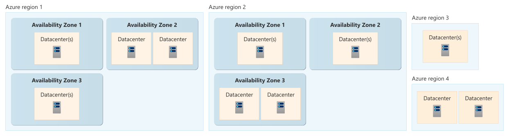
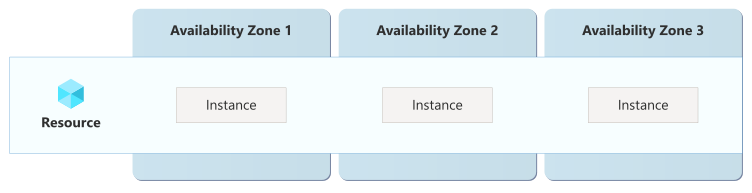
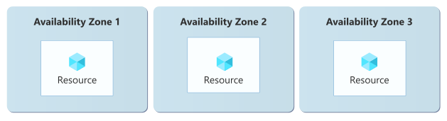

# Available Zone (AZ)

> 참고: [가용성 영역 개요 - Microsoft Docs](https://learn.microsoft.com/ko-kr/azure/reliability/availability-zones-overview?tabs=azure-cli)

Region 내에서는 데이터 센터 그룹으로 구분된 Available Zone(AZ) 제공. 각 AZ에는 독립적인 전원, 냉각 및 네트워킹 인프라가 있으므로 한 AZ에서 중단이 발생하는 경우 나머지 AZ에서 서비스, 용량 및 고가용성 지원 가능

## Available Zone 지원 유형

- Zone-Redundant 리소스: 데이터의 가용성에 영향을 주지 않도록 데이터를 여러 AZ에 복제. 일부 서비스는 지원되는 Region에서 자동으로 Zone-Redundant로 구성되는 반면, 다른 서비스는 Zone-Redundant로 직접 구성해야 함

- Zonal 리소스: 사용자가 직접 선택한 단일 AZ에 배포. Zonal 배포는 AZ 중단에 대한 복원력을 자동으로 제공하지 않음. AZ 중단에 대한 복원력을 갖추려면 Region 내 여러 AZ에 별도의 리소스를 분산하여 아키텍처를 설계해야 함

## Available Zone 아키텍처 지침

- 프로덕션 워크로드가 있는 Region이 AZ를 지원하는 경우 여러 AZ를 사용하도록 구성
- 중요 업무용 워크로드의 경우 다중 Region 및 다중 AZ 솔루션을 고려 필요