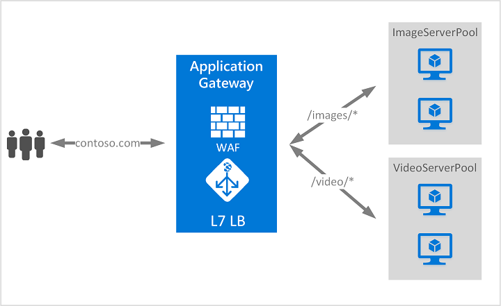

# Application Gateway (AppGW)

> 참고: [Application Gateway 개요 - Microsoft Docs](https://learn.microsoft.com/ko-kr/azure/application-gateway/overview)

웹 애플리케이션에 대한 트래픽을 관리하는 웹 트래픽 Load Balancer

- 기존 Load Balancer: IP 주소 및 포트 기반 트래픽 라우팅
- AppGW: URL 경로 및 호스트 헤더와 같은 HTTP 요청 특성 기반으로 지능형 라우팅

예를 들어, URL에 /images이 포함된 요청은 이미지에 최적화된 서버로 라우팅하고, /video이 포함된 요청은 비디오 콘텐츠에 최적화된 서버로 라우팅 가능


## Azure Application Gateway v2

Application Gateway v2는 Application Gateway의 최신 버전. v1 대비 성능 향상, 자동 스케일링, Zone-Redundancy 및 정적 VIP 등의 이점 제공.

### 주요기능

- TCP/TLS 프록시: TCP 프로토콜 및 TLS 프록시 지원.
- 자동 스케일링: 트래픽 부하 패턴의 변화에 따라 스케일 아웃하거나 스케일 인 가능. 자동 스케일링을 사용하면 프로비전 시 배포 크기 또는 인스턴스 수를 선택할 필요가 없음.
- Zone-Redundancy: Application Gateway 또는 WAF 배포는 기본적으로 여러 AZ에 걸쳐 배포되므로 각 AZ에 별도의 Application Gateway 인스턴스를 프로비전할 필요가 없음. 인스턴스는 최소 두 개의 AZ에 배포되어 AZ 오류에 대한 복원력이 향상되며, 백엔드 풀도 AZ 전반에 분산 배포 가능.
- 정적 VIP: Application Gateway와 연결된 VIP가 재시작 후에도 배포 수명 주기 동안 변경되지 않음.
- Header Rewrite: v2 SKU를 사용하여 HTTP 요청 및 응답 헤더를 추가, 제거 또는 업데이트 가능.
- Key Vault 통합: HTTPS 수신기에 연결된 서버 인증서에 대한 Key Vault 통합을 지원.
- 상호 인증(mTLS): 클라이언트 요청 인증을 지원.
- AKS Ingress 컨트롤러: Application Gateway v2 Ingress 컨트롤러를 사용하면 Application Gateway를 AKS 클러스터의 Ingress로 사용 가능.
- Private Link: v2 SKU는 Private Endpoint를 사용하여 다른 Region 및 구독의 다른 VNet으로부터 Private 연결을 제공.
- 성능 향상: v2 SKU는 Standard/WAF SKU 대비 최대 5배 더 나은 TLS 오프로드 성능을 제공.
- 빠른 배포 및 업데이트: v2 SKU는 Standard/WAF SKU 대비 빠른 배포 및 업데이트 시간을 제공하며, WAF 구성 변경도 포함.

## 구성 요소 및 요청 흐름

AppGW는 아래 구성 요소들이 순서대로 연결되어 클라이언트 요청을 백엔드로 전달함.

```
Client
  │
  ▼
Frontend IP                  ← Public 또는 Private IP. 클라이언트가 접속하는 진입점
  │
  ▼
Listener                     ← 포트/프로토콜/호스트 기준으로 요청 수신
  │   ↑ WAF Policy 연결       ← 백엔드 전달 전 HTTP 요청 검사 및 차단
  │
  ▼
Routing Rule                 ← Listener와 Backend Pool을 연결하는 규칙
  │
  ├──────────────────────────────────────┐
  ▼                                      ▼
Backend Pool                        HTTP Settings
(VM, App Service 등 실제 서버)       (백엔드 통신 방식: 포트, 프로토콜, 타임아웃 등)
  │
  ▼
Health Probe                 ← Backend Pool 내 서버 상태 주기적 확인
```

| 구성 요소 | 역할 |
|-----------|------|
| Frontend IP | 클라이언트 요청을 받는 진입점 (Public/Private) |
| Listener | 포트·프로토콜·호스트 기준으로 요청 수신, WAF Policy 연결 |
| Routing Rule | Listener → Backend Pool 연결 규칙 |
| HTTP Settings | 백엔드와의 통신 방식 정의 |
| Backend Pool | 실제 요청을 처리하는 서버 그룹 |
| Health Probe | 백엔드 서버 상태 체크, 비정상 서버를 풀에서 제외 |

## Web Application Firewall (WAF)

일반적인 악용과 취약성으로부터 웹 애플리케이션을 중앙 집중식으로 보호하기 위한 리소스. SQL injection, XSS 같은 애플리케이션 레벨 공격 패턴 탐지/차단. 애플리케이션 코드단에서 SQL 삽입 및 교차 사이트 스크립팅 공격을 막기에는 어려움이 있기 때문에 WAF를 애플리케이션 앞에 둠으로써 보안관리를 더욱 간단하게 하도록 지원

Application Gateway의 Azure 웹 애플리케이션 방화벽은 OWASP(Open Web Application Security Project)의 CRS(핵심 규칙 집합)를 기반으로 함.

다음은 요청 헤더에 사용자 에이전트 evilbot이 포함된 경우 트래픽을 차단하는 사용자 지정 규칙 예시
```
# Create a User-Agent header custom rule 
$variable = New-AzApplicationGatewayFirewallMatchVariable -VariableName RequestHeaders -Selector User-Agent
$condition = New-AzApplicationGatewayFirewallCondition -MatchVariable $variable -Operator Contains -MatchValue "evilbot" -Transform Lowercase -NegationCondition $False  
$rule = New-AzApplicationGatewayFirewallCustomRule -Name blockEvilBot -Priority 2 -RuleType MatchRule -MatchCondition $condition -Action Block -State Enabled
 
# Create a geo-match custom rule
$var2 = New-AzApplicationGatewayFirewallMatchVariable -VariableName RemoteAddr
$condition2 = New-AzApplicationGatewayFirewallCondition -MatchVariable $var2 -Operator GeoMatch -MatchValue "US" -NegationCondition $True
$rule2 = New-AzApplicationGatewayFirewallCustomRule -Name allowUS -Priority 14 -RuleType MatchRule -MatchCondition $condition2 -Action Block -State Enabled
```

## Listener

Listener는 포트, 프로토콜, 호스트, IP 주소를 사용하여 들어오는 연결 요청을 확인하는 논리적 엔터티. Listener를 구성하는 경우 게이트웨이에 들어오는 요청의 해당 값과 일치하는 설정 값을 입력해야 함. Listener를 만든 후에는 요청 라우팅 규칙과 연결하며, 이 규칙이 수신된 요청을 백엔드로 라우팅하는 방법을 결정함.

### Listener 구성 요소

| 항목 | 설명 |
|------|------|
| Frontend IP | 수신 대기할 IP (Public/Private) |
| Frontend Port | 수신 대기할 포트 (80, 443 등 커스텀 포트 포함) |
| Protocol | HTTP 또는 HTTPS |
| Host name | Multi-site 구성 시 도메인 기준으로 요청 구분 |

### Listener 유형

- **Basic**: 특정 도메인 구분 없이 해당 포트로 들어오는 모든 요청을 단일 백엔드 풀로 전달
- **Multi-site**: 동일한 포트에서 HTTP Host 헤더를 기준으로 요청을 구분하여 서로 다른 백엔드 풀로 전달. 하나의 AppGW에서 여러 도메인 운영 가능

```
443 포트로 들어오는 요청
  ├── Host: app1.example.com → Backend Pool A
  └── Host: app2.example.com → Backend Pool B
```

### HTTPS와 TLS 종료

프로토콜을 HTTPS로 설정하면 클라이언트-AppGW 구간의 TLS를 AppGW에서 종료함. 이 경우 수신기에 PFX 형식의 TLS/SSL 인증서를 등록해야 하며, Key Vault 통합을 통해 인증서를 관리할 수 있음.

- **TLS 종료**: AppGW에서 TLS를 복호화하고 백엔드에는 HTTP로 전달
- **End-to-End TLS**: AppGW에서 복호화 후 백엔드로 재암호화하여 전달. HTTP Settings에서도 HTTPS 설정 필요

## Routing Rule

Listener에서 수신된 요청을 어느 Backend Pool로 보낼지 연결하는 규칙. Listener, Backend Pool, HTTP Settings를 하나로 묶어 요청 처리 방식을 정의함.

### Rule 유형

- **Basic**: Listener로 들어오는 모든 요청을 단일 Backend Pool로 전달
- **Path-based**: URL 경로에 따라 서로 다른 Backend Pool로 전달. 경로 패턴은 URL의 쿼리 파라미터가 아닌 경로에만 적용됨

```
Basic Rule
  Listener → Backend Pool A (모든 요청)

Path-based Rule
  Listener ─┬── /images/* → Backend Pool A (이미지 서버)
             ├── /video/*  → Backend Pool B (영상 서버)
             └── (default) → Backend Pool C (기본 서버)
```

### Rule 구성 요소

| 항목 | 설명 |
|------|------|
| Listener | 규칙이 적용될 수신기 |
| Backend Pool | 요청을 전달할 서버 그룹 |
| HTTP Settings | 백엔드와의 통신 방식 (포트, 프로토콜, 타임아웃 등) |

### Redirection

Backend Pool으로 전달하는 대신 다른 Listener나 외부 URL로 리다이렉트 가능

- **HTTP → HTTPS 리다이렉트**: HTTP Listener에서 HTTPS Listener로 트래픽 전환 시 사용
- **외부 사이트 리다이렉트**: 특정 경로 요청을 외부 URL로 전환

리다이렉트 타입: Permanent(301), Found(302), Temporary(307), See other(303)

## Backend Pool

요청을 실제로 처리하는 백엔드 서버들의 그룹. Routing Rule에 의해 선택되며, 풀 내 서버들에 트래픽을 분산함.

### 등록 가능한 백엔드 서버 종류

| 종류 | 설명 |
|------|------|
| VM / VM Scale Set | Azure 가상 머신 또는 자동 확장 VM 그룹 |
| App Service / Container Apps | Azure에서 관리하는 웹앱/컨테이너 서비스 |
| 내부 IP 주소 | VNet 안에 있는 리소스의 사설 IP (VNet Peering, VPN Gateway 필요) |
| 공용 IP 주소 | 인터넷에서 접근 가능한 공인 IP |
| FQDN | DNS로 조회 가능한 도메인 주소 (예: app.example.com) |
| 온프레미스 서버 | ExpressRoute 또는 VPN으로 연결된 사내 서버 |

### 특징

- 하나의 AppGW에 여러 Backend Pool 생성 가능. 요청 유형이나 마이크로서비스별로 풀 분리 가능
- Backend Pool 멤버는 IP 연결이 있다면 다른 Region, 다른 데이터센터, Azure 외부에도 배치 가능
- Backend Pool 자체에는 로드밸런싱 설정이 없으며, HTTP Settings에서 통신 방식을 정의함

## Health Probe

Backend Pool에 등록된 서버들의 상태를 주기적으로 확인하는 기능. 비정상 서버로의 트래픽 전송을 자동으로 중단하고, 이후 해당 서버가 정상으로 회복되면 자동으로 트래픽을 다시 보냄.

### 기본 프로브 vs 사용자 지정 프로브

- **기본 프로브**: 별도 설정 없이 자동으로 동작. HTTP GET 요청을 보내 200~399 응답이 오면 정상으로 판단
- **사용자 지정 프로브**: 호스트명, 경로, 간격, 실패 허용 횟수 등을 직접 설정. 각 Backend Pool마다 별도 구성 권장

### 기본 프로브 설정값

| 항목 | 기본값 | 설명 |
|------|--------|------|
| 간격 | 30초 | 프로브 전송 주기 |
| 타임아웃 | 30초 | 응답 대기 시간. 초과 시 실패로 판단 |
| 비정상 임계값 | 3회 | 연속 실패 횟수가 이 값에 도달하면 서버를 비정상으로 표시 |

### 사용자 지정 프로브 설정 항목

| 항목 | 설명 |
|------|------|
| 프로토콜 | HTTP 또는 HTTPS |
| 호스트 | 프로브 요청에 사용할 호스트명 |
| 경로 | 상태 확인할 URL 경로 (예: `/health`) |
| 간격 | 프로브 전송 주기 (초) |
| 타임아웃 | 응답 대기 시간 (초) |
| 비정상 임계값 | 연속 실패 허용 횟수 |

### 정상 응답 조건 커스터마이징

기본적으로 HTTP 상태 코드 200~399를 정상으로 판단하지만, 사용자 지정 프로브에서는 아래 두 조건을 직접 설정 가능

- **상태 코드 일치**: 특정 코드 또는 범위 지정 (예: 인증 필요한 서버가 403을 반환하는 경우 403도 정상으로 허용)
- **응답 본문 일치**: 응답 본문에 특정 문자열 포함 여부 확인 (예: `"Healthy"`)