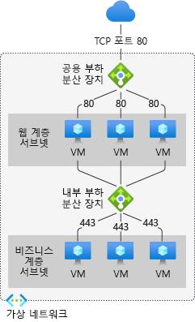

# Internal LoadBalancer (ILB)

네트워크 트래픽을 백 엔드 VM(가상 머신) 또는 VMSS(가상 머신 확장 집합)에 분산하는 클라우드 서비스

OSI(Open Systems Interconnect) 모델의 계층 4에서 작동. 클라이언트의 단일 연락 지점으로, 프런트 엔드에 도착하는 인바운드 흐름을 구성된 부하 분산 규칙 및 상태 프로브에 따라 백 엔드 풀 인스턴스에 분산

- 퍼블릭 부하 분산 장치
 공인 IP를 프런트 엔드로 사용하여 인터넷 트래픽을 VM에 분산. VM에서 시작된 아웃바운드 연결 시 사설 IP를 공인 IP로 변환하는 NAT 기능도 제공. 웹 서비스에는 주로 사용되지 않으며, TCP/UDP 기반 서비스에 사용

- 내부 부하 분산 장치
 사설 IP를 프런트 엔드로 사용하여 VNet 내부 트래픽만 분산. 온프레미스에서 ExpressRoute 또는 VPN으로 연결된 하이브리드 환경에서도 프런트 엔드 IP로 접근 가능
